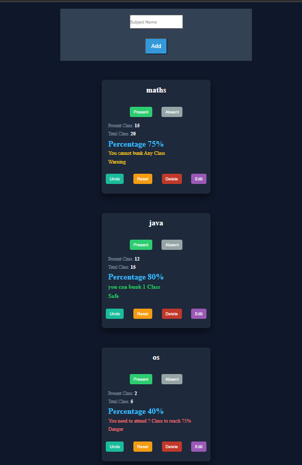
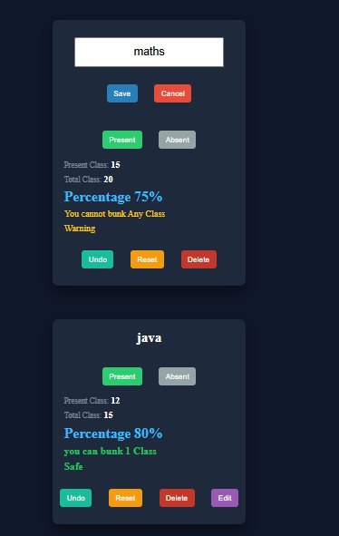
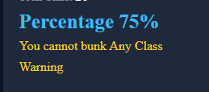

# 📊 Attendance Tracker App

A simple and efficient web app to track subject-wise attendance and help students stay above the 75% requirement with real-time insights.

---

## 📷 Preview

---

## 🔗 Live Demo

👉 [View Live Project](https://priyanshpanjabi0922.github.io/Attendance-app/)

---

## 🚀 Features

- ➕ Add subjects with validation
- 📈 Track Present & Absent classes
- 📊 Real-time attendance percentage calculation
- ⚠️ Smart insights:
  - Shows how many classes you can bunk
  - Shows how many classes you need to attend
- 🔄 Undo last action
- ♻️ Reset subject data
- 🗑️ Delete subject
- ✏️ Edit / Rename subject (with full validation)
- 💾 Persistent data using localStorage

---

## 🎯 How It Works

Each subject stores:
- Present classes
- Total classes
- Last action (for undo)
- Lock state (to prevent repeated clicks)

Attendance is calculated dynamically and categorized into:

- ✅ Safe (>75%)
- ⚠️ Warning (=75%)
- ❌ Danger (<75%)

---

## 🐞 Challenges & Fixes

- Fixed data loss issue caused by changing server ports
- Ensured consistent use of localStorage with a single key
- Resolved state update bugs during rename functionality
- Fixed issue where data was overwritten unintentionally
- Implemented proper validation for both add and edit flows
- Improved UI consistency by aligning message and status logic

---

## 🧠 Key Learnings

- Importance of **localStorage consistency**
- Understanding how **environment (port, domain)** affects storage
- Managing **state updates correctly**
- Debugging using **test → verify → fix approach**
- Building UI with **clear action-based color system**
- Avoiding assumptions and focusing on **root cause debugging**

---

## 🛠️ Tech Stack

- HTML
- CSS
- JavaScript (Vanilla)

---

## 📌 Future Improvements

- Add charts / visual analytics
- Add login system (user-specific data)
- Export attendance report
- Mobile UI optimization

---

## ✨ Author

Your Name
